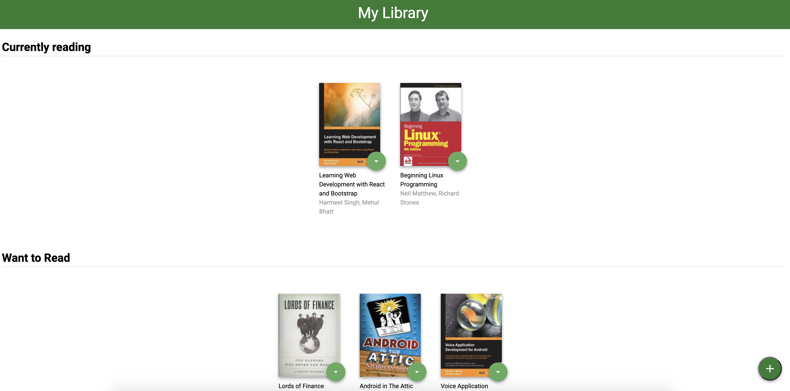
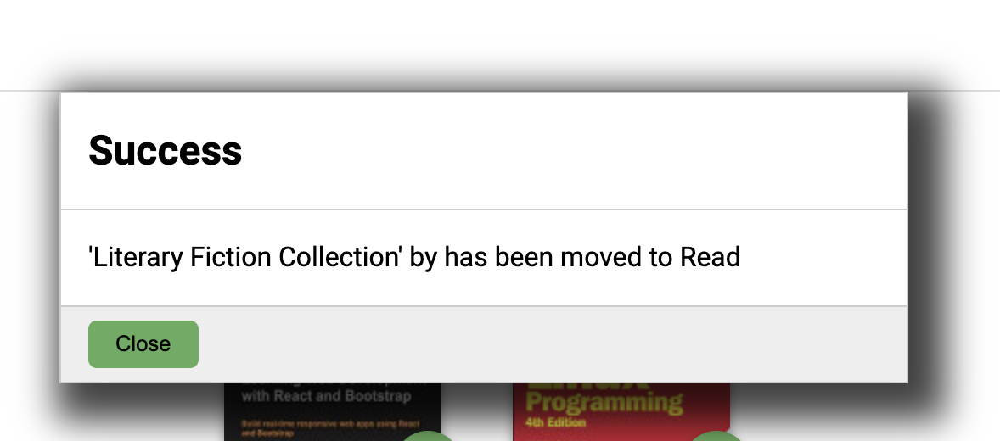
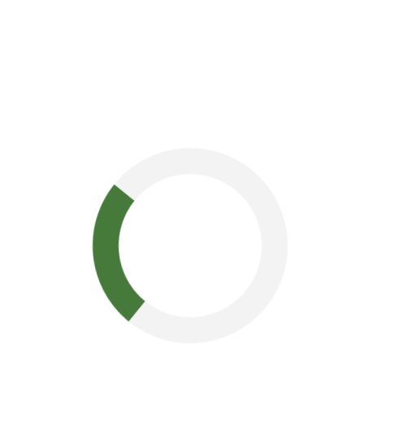

# MyReads Project

This is Belén Pruvost's assessment project for the React Fundamentals module, included in Udacity's React Fundamentals course. 

It is a bookshelf app that allows you to select and categorize books you have read, are currently reading, or want to read. 
Information is persisted through an API as you interact with the application.

## Running the app locally
* install all project dependencies with `npm install`
* start the development server with `npm start`

## Sections

### My Library
This section shows the three shelves available:
- Currently reading
- Want to Read
- Read

Each shelf shows the set of books that the user has denoted as currently reading, wanted to read and read, respectively.

Each book shows its title, its authors and its cover. If there is no specific cover specified on the API, a default cover image will be displayed instead.
Moreover, each book has a control that allows you to move them to a different shelf, or out of the library.

When a movement operation is done, a success modal will be displayed, and the book will be moved accordingly.

When an async operation is done, a loader will be displayed.

This section also provides access to the Search page.

### Search
This section allows you to search for books. The list of available search terms that will actually return results is available [here](SEARCH_TERMS.md). 

However, if no results are found - a message indicating so will be displayed.

Also - if there is any issue connecting to the API, an error image will be displayed.

When results are indeed found, books are displayed in the same way as in the Library section, indicating their title, their authors and their cover. A control is available to move them into or out of the shelves.

By clicking the back button (on the page or on the browser), it is possible to go back to the Library page.